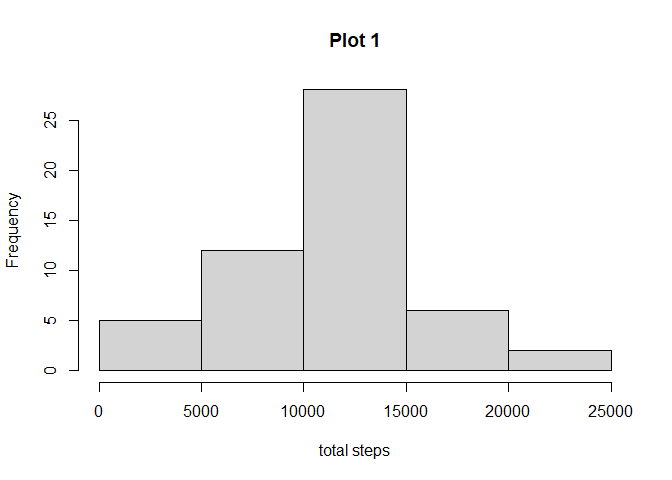
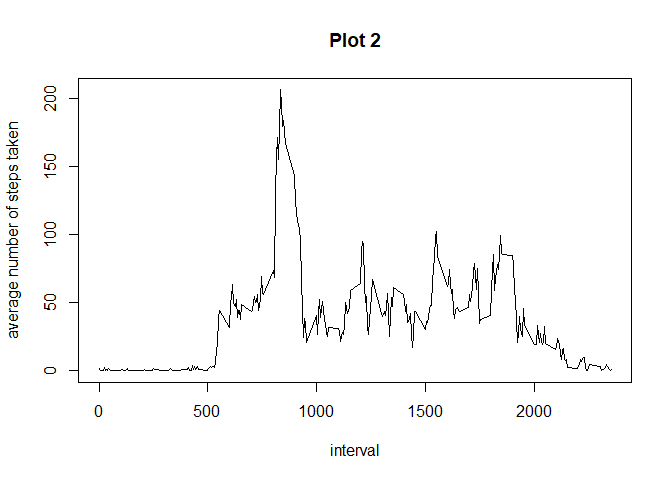
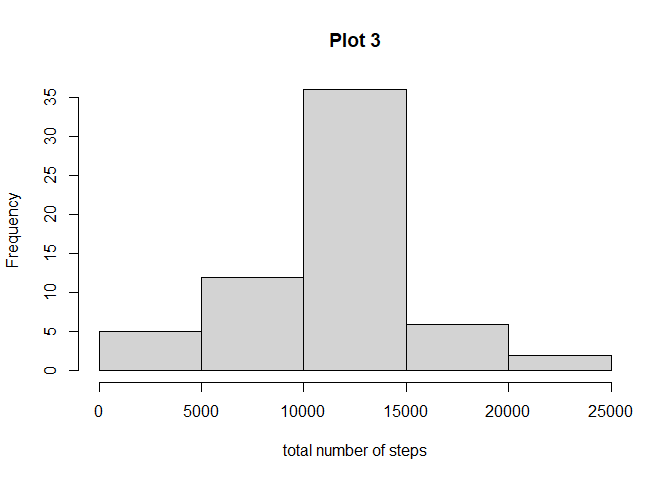
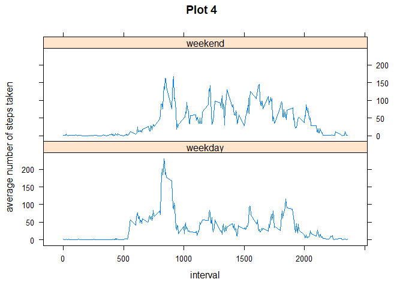

## Loading and preprocessing the data

We will use dplyr package for this analysis


```r
library(dplyr)
```

First we load the data


```r
data <- read.csv("C:/Users/User/Desktop/Data Science/Reproducible Research/Project Week 2/activity.csv")
data$date <- as.Date(data$date , format = "%Y-%m-%d")
```

## What is mean total number of steps taken per day?

We will ignore the missing values in the dataset.


```r
m <- complete.cases(data)
dat <- data[m,]
```

Calculation of the total number of steps taken per day:

```r
da <- group_by(dat, date)
Q1 <- as.data.frame(summarize(da, totsteps = sum(steps)))
```

```
## `summarise()` ungrouping output (override with `.groups` argument)
```

Histogram of the total number of steps taken each day

```r
hist(Q1$totsteps, xlab ="total steps", main = "Plot 1")
```

<!-- -->

Mean and median of the total number of steps taken per day:

```r
Q1.2 <- as.data.frame(summarize(da, totalsteps = sum(steps), mean = mean(steps), median = median(steps)))
Q1.2
```

```
##          date totalsteps       mean median
## 1  2012-10-02        126  0.4375000      0
## 2  2012-10-03      11352 39.4166667      0
## 3  2012-10-04      12116 42.0694444      0
## 4  2012-10-05      13294 46.1597222      0
## 5  2012-10-06      15420 53.5416667      0
## 6  2012-10-07      11015 38.2465278      0
## 7  2012-10-09      12811 44.4826389      0
## 8  2012-10-10       9900 34.3750000      0
## 9  2012-10-11      10304 35.7777778      0
## 10 2012-10-12      17382 60.3541667      0
## 11 2012-10-13      12426 43.1458333      0
## 12 2012-10-14      15098 52.4236111      0
## 13 2012-10-15      10139 35.2048611      0
## 14 2012-10-16      15084 52.3750000      0
## 15 2012-10-17      13452 46.7083333      0
## 16 2012-10-18      10056 34.9166667      0
## 17 2012-10-19      11829 41.0729167      0
## 18 2012-10-20      10395 36.0937500      0
## 19 2012-10-21       8821 30.6284722      0
## 20 2012-10-22      13460 46.7361111      0
## 21 2012-10-23       8918 30.9652778      0
## 22 2012-10-24       8355 29.0104167      0
## 23 2012-10-25       2492  8.6527778      0
## 24 2012-10-26       6778 23.5347222      0
## 25 2012-10-27      10119 35.1354167      0
## 26 2012-10-28      11458 39.7847222      0
## 27 2012-10-29       5018 17.4236111      0
## 28 2012-10-30       9819 34.0937500      0
## 29 2012-10-31      15414 53.5208333      0
## 30 2012-11-02      10600 36.8055556      0
## 31 2012-11-03      10571 36.7048611      0
## 32 2012-11-05      10439 36.2465278      0
## 33 2012-11-06       8334 28.9375000      0
## 34 2012-11-07      12883 44.7326389      0
## 35 2012-11-08       3219 11.1770833      0
## 36 2012-11-11      12608 43.7777778      0
## 37 2012-11-12      10765 37.3784722      0
## 38 2012-11-13       7336 25.4722222      0
## 39 2012-11-15         41  0.1423611      0
## 40 2012-11-16       5441 18.8923611      0
## 41 2012-11-17      14339 49.7881944      0
## 42 2012-11-18      15110 52.4652778      0
## 43 2012-11-19       8841 30.6979167      0
## 44 2012-11-20       4472 15.5277778      0
## 45 2012-11-21      12787 44.3993056      0
## 46 2012-11-22      20427 70.9270833      0
## 47 2012-11-23      21194 73.5902778      0
## 48 2012-11-24      14478 50.2708333      0
## 49 2012-11-25      11834 41.0902778      0
## 50 2012-11-26      11162 38.7569444      0
## 51 2012-11-27      13646 47.3819444      0
## 52 2012-11-28      10183 35.3576389      0
## 53 2012-11-29       7047 24.4687500      0
```

## What is the average daily activity pattern?

We will ignore the missing values in the dataset.


```r
m <- complete.cases(data)
dat <- data[m,]
```

Make a plot of the 5 minute interval vs the average number of steps taken, averaged across all days.


```r
da2 <- group_by(dat, interval)
Q2 <- as.data.frame(summarize(da2, totsteps = sum(steps), mean = mean(steps), interval = interval))
with(Q2, plot(interval, mean, type = "l", main = "Plot 2", ylab = "average number of steps taken"))
```

<!-- -->

The 5 minute interval on average across all days that contains the maximum number of steps is calculated with:


```r
print(Q2[which.max(Q2$mean), "interval"])
```

```
## [1] 835
```


## Imputing missing values

The total number of missing values in the dataset is calculated with


```r
sum(is.na(data))
```

```
## [1] 2304
```

We create a new dataset called **copy_data** that is a copy of the initial data set.


```r
copy_data <- data.frame(data)
```

We fill in all the missing values of the dataset **copy_data**, with the mean for the 5 minute interval.


```r
pls <- group_by(copy_data, interval)
Q3 <- as.data.frame(summarize(pls, mean = mean(steps, na.rm = TRUE)))
copy_data$steps <- ifelse(is.na(copy_data$steps) == TRUE, Q3$mean[Q3$interval %in% copy_data$interval], copy_data$steps) 
```

We rearrange the data to obtain the total number of steps taken each day, and use it to make a histogram:


```r
gr <- group_by(copy_data, date)
sum3 <- as.data.frame(summarize(gr, totsteps = sum(steps)))
hist(sum3$totsteps, xlab = "total number of steps", main = "Plot 3")
```

<!-- -->

We calculate the mean and median of the total number of steps taken per day:


```r
Q3.2 <- as.data.frame(summarize(gr, totalsteps = sum(steps),  mean = mean(steps), median = median(steps)))
Q3.2
```

```
##          date totalsteps       mean   median
## 1  2012-10-01   10766.19 37.3825996 34.11321
## 2  2012-10-02     126.00  0.4375000  0.00000
## 3  2012-10-03   11352.00 39.4166667  0.00000
## 4  2012-10-04   12116.00 42.0694444  0.00000
## 5  2012-10-05   13294.00 46.1597222  0.00000
## 6  2012-10-06   15420.00 53.5416667  0.00000
## 7  2012-10-07   11015.00 38.2465278  0.00000
## 8  2012-10-08   10766.19 37.3825996 34.11321
## 9  2012-10-09   12811.00 44.4826389  0.00000
## 10 2012-10-10    9900.00 34.3750000  0.00000
## 11 2012-10-11   10304.00 35.7777778  0.00000
## 12 2012-10-12   17382.00 60.3541667  0.00000
## 13 2012-10-13   12426.00 43.1458333  0.00000
## 14 2012-10-14   15098.00 52.4236111  0.00000
## 15 2012-10-15   10139.00 35.2048611  0.00000
## 16 2012-10-16   15084.00 52.3750000  0.00000
## 17 2012-10-17   13452.00 46.7083333  0.00000
## 18 2012-10-18   10056.00 34.9166667  0.00000
## 19 2012-10-19   11829.00 41.0729167  0.00000
## 20 2012-10-20   10395.00 36.0937500  0.00000
## 21 2012-10-21    8821.00 30.6284722  0.00000
## 22 2012-10-22   13460.00 46.7361111  0.00000
## 23 2012-10-23    8918.00 30.9652778  0.00000
## 24 2012-10-24    8355.00 29.0104167  0.00000
## 25 2012-10-25    2492.00  8.6527778  0.00000
## 26 2012-10-26    6778.00 23.5347222  0.00000
## 27 2012-10-27   10119.00 35.1354167  0.00000
## 28 2012-10-28   11458.00 39.7847222  0.00000
## 29 2012-10-29    5018.00 17.4236111  0.00000
## 30 2012-10-30    9819.00 34.0937500  0.00000
## 31 2012-10-31   15414.00 53.5208333  0.00000
## 32 2012-11-01   10766.19 37.3825996 34.11321
## 33 2012-11-02   10600.00 36.8055556  0.00000
## 34 2012-11-03   10571.00 36.7048611  0.00000
## 35 2012-11-04   10766.19 37.3825996 34.11321
## 36 2012-11-05   10439.00 36.2465278  0.00000
## 37 2012-11-06    8334.00 28.9375000  0.00000
## 38 2012-11-07   12883.00 44.7326389  0.00000
## 39 2012-11-08    3219.00 11.1770833  0.00000
## 40 2012-11-09   10766.19 37.3825996 34.11321
## 41 2012-11-10   10766.19 37.3825996 34.11321
## 42 2012-11-11   12608.00 43.7777778  0.00000
## 43 2012-11-12   10765.00 37.3784722  0.00000
## 44 2012-11-13    7336.00 25.4722222  0.00000
## 45 2012-11-14   10766.19 37.3825996 34.11321
## 46 2012-11-15      41.00  0.1423611  0.00000
## 47 2012-11-16    5441.00 18.8923611  0.00000
## 48 2012-11-17   14339.00 49.7881944  0.00000
## 49 2012-11-18   15110.00 52.4652778  0.00000
## 50 2012-11-19    8841.00 30.6979167  0.00000
## 51 2012-11-20    4472.00 15.5277778  0.00000
## 52 2012-11-21   12787.00 44.3993056  0.00000
## 53 2012-11-22   20427.00 70.9270833  0.00000
## 54 2012-11-23   21194.00 73.5902778  0.00000
## 55 2012-11-24   14478.00 50.2708333  0.00000
## 56 2012-11-25   11834.00 41.0902778  0.00000
## 57 2012-11-26   11162.00 38.7569444  0.00000
## 58 2012-11-27   13646.00 47.3819444  0.00000
## 59 2012-11-28   10183.00 35.3576389  0.00000
## 60 2012-11-29    7047.00 24.4687500  0.00000
## 61 2012-11-30   10766.19 37.3825996 34.11321
```


We can see that the values do not almost differ from the first part of the assigment where we removed the missing values.

While mean.x, median.x and totalsteps.x correspond to the dataset **Q3.2** whereas, mean.y, median.y and totalsteps.y correspond to the dataset **Q1.2** where the missing values where removed.


```r
last <- merge(Q3.2, Q1.2, by = "date", all = TRUE)
last
```

```
##          date totalsteps.x     mean.x median.x totalsteps.y     mean.y median.y
## 1  2012-10-01     10766.19 37.3825996 34.11321           NA         NA       NA
## 2  2012-10-02       126.00  0.4375000  0.00000          126  0.4375000        0
## 3  2012-10-03     11352.00 39.4166667  0.00000        11352 39.4166667        0
## 4  2012-10-04     12116.00 42.0694444  0.00000        12116 42.0694444        0
## 5  2012-10-05     13294.00 46.1597222  0.00000        13294 46.1597222        0
## 6  2012-10-06     15420.00 53.5416667  0.00000        15420 53.5416667        0
## 7  2012-10-07     11015.00 38.2465278  0.00000        11015 38.2465278        0
## 8  2012-10-08     10766.19 37.3825996 34.11321           NA         NA       NA
## 9  2012-10-09     12811.00 44.4826389  0.00000        12811 44.4826389        0
## 10 2012-10-10      9900.00 34.3750000  0.00000         9900 34.3750000        0
## 11 2012-10-11     10304.00 35.7777778  0.00000        10304 35.7777778        0
## 12 2012-10-12     17382.00 60.3541667  0.00000        17382 60.3541667        0
## 13 2012-10-13     12426.00 43.1458333  0.00000        12426 43.1458333        0
## 14 2012-10-14     15098.00 52.4236111  0.00000        15098 52.4236111        0
## 15 2012-10-15     10139.00 35.2048611  0.00000        10139 35.2048611        0
## 16 2012-10-16     15084.00 52.3750000  0.00000        15084 52.3750000        0
## 17 2012-10-17     13452.00 46.7083333  0.00000        13452 46.7083333        0
## 18 2012-10-18     10056.00 34.9166667  0.00000        10056 34.9166667        0
## 19 2012-10-19     11829.00 41.0729167  0.00000        11829 41.0729167        0
## 20 2012-10-20     10395.00 36.0937500  0.00000        10395 36.0937500        0
## 21 2012-10-21      8821.00 30.6284722  0.00000         8821 30.6284722        0
## 22 2012-10-22     13460.00 46.7361111  0.00000        13460 46.7361111        0
## 23 2012-10-23      8918.00 30.9652778  0.00000         8918 30.9652778        0
## 24 2012-10-24      8355.00 29.0104167  0.00000         8355 29.0104167        0
## 25 2012-10-25      2492.00  8.6527778  0.00000         2492  8.6527778        0
## 26 2012-10-26      6778.00 23.5347222  0.00000         6778 23.5347222        0
## 27 2012-10-27     10119.00 35.1354167  0.00000        10119 35.1354167        0
## 28 2012-10-28     11458.00 39.7847222  0.00000        11458 39.7847222        0
## 29 2012-10-29      5018.00 17.4236111  0.00000         5018 17.4236111        0
## 30 2012-10-30      9819.00 34.0937500  0.00000         9819 34.0937500        0
## 31 2012-10-31     15414.00 53.5208333  0.00000        15414 53.5208333        0
## 32 2012-11-01     10766.19 37.3825996 34.11321           NA         NA       NA
## 33 2012-11-02     10600.00 36.8055556  0.00000        10600 36.8055556        0
## 34 2012-11-03     10571.00 36.7048611  0.00000        10571 36.7048611        0
## 35 2012-11-04     10766.19 37.3825996 34.11321           NA         NA       NA
## 36 2012-11-05     10439.00 36.2465278  0.00000        10439 36.2465278        0
## 37 2012-11-06      8334.00 28.9375000  0.00000         8334 28.9375000        0
## 38 2012-11-07     12883.00 44.7326389  0.00000        12883 44.7326389        0
## 39 2012-11-08      3219.00 11.1770833  0.00000         3219 11.1770833        0
## 40 2012-11-09     10766.19 37.3825996 34.11321           NA         NA       NA
## 41 2012-11-10     10766.19 37.3825996 34.11321           NA         NA       NA
## 42 2012-11-11     12608.00 43.7777778  0.00000        12608 43.7777778        0
## 43 2012-11-12     10765.00 37.3784722  0.00000        10765 37.3784722        0
## 44 2012-11-13      7336.00 25.4722222  0.00000         7336 25.4722222        0
## 45 2012-11-14     10766.19 37.3825996 34.11321           NA         NA       NA
## 46 2012-11-15        41.00  0.1423611  0.00000           41  0.1423611        0
## 47 2012-11-16      5441.00 18.8923611  0.00000         5441 18.8923611        0
## 48 2012-11-17     14339.00 49.7881944  0.00000        14339 49.7881944        0
## 49 2012-11-18     15110.00 52.4652778  0.00000        15110 52.4652778        0
## 50 2012-11-19      8841.00 30.6979167  0.00000         8841 30.6979167        0
## 51 2012-11-20      4472.00 15.5277778  0.00000         4472 15.5277778        0
## 52 2012-11-21     12787.00 44.3993056  0.00000        12787 44.3993056        0
## 53 2012-11-22     20427.00 70.9270833  0.00000        20427 70.9270833        0
## 54 2012-11-23     21194.00 73.5902778  0.00000        21194 73.5902778        0
## 55 2012-11-24     14478.00 50.2708333  0.00000        14478 50.2708333        0
## 56 2012-11-25     11834.00 41.0902778  0.00000        11834 41.0902778        0
## 57 2012-11-26     11162.00 38.7569444  0.00000        11162 38.7569444        0
## 58 2012-11-27     13646.00 47.3819444  0.00000        13646 47.3819444        0
## 59 2012-11-28     10183.00 35.3576389  0.00000        10183 35.3576389        0
## 60 2012-11-29      7047.00 24.4687500  0.00000         7047 24.4687500        0
## 61 2012-11-30     10766.19 37.3825996 34.11321           NA         NA       NA
```


## Are there differences in activity patterns between weekdays and weekends?

We will use lattice package for this analysis


```r
library(lattice)
```

We create a new factor variable in the dataset with two leveles; weekday and weekend.


```r
q4 <- mutate(copy_data, day = weekdays(copy_data$date))
q4$day <- ifelse(q4$day %in% c("sábado", "domingo"), "weekend", "weekday")
head(q4)
```

```
##       steps       date interval     day
## 1 1.7169811 2012-10-01        0 weekday
## 2 0.3396226 2012-10-01        5 weekday
## 3 0.1320755 2012-10-01       10 weekday
## 4 0.1509434 2012-10-01       15 weekday
## 5 0.0754717 2012-10-01       20 weekday
## 6 2.0943396 2012-10-01       25 weekday
```

We rearrange the dataset **copy_data**, to make a plot of the 5 minute interval vs the average number of steps taken, averaged across all weekday days or weekend days.


```r
gr4 <- group_by(q4, day, interval)
Q4.2 <- as.data.frame(summarize(gr4, mean = mean(steps)))
xyplot(mean ~ interval | day, data = Q4.2 , layout = c(1, 2), type = "l", main = "Plot 4", ylab = "average number of steps taken")
```

<!-- -->
