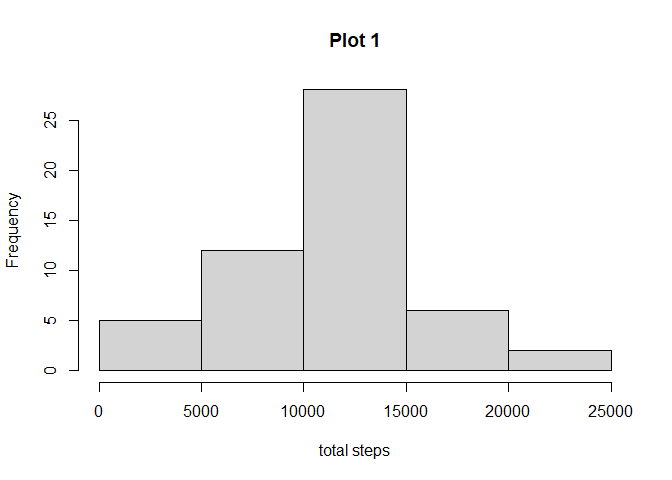
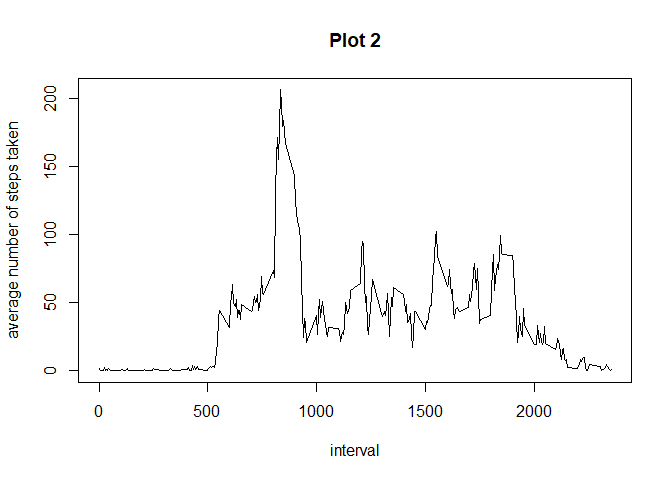
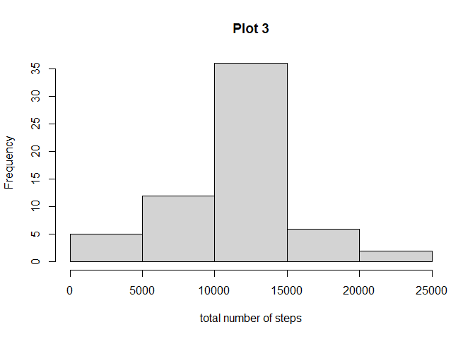
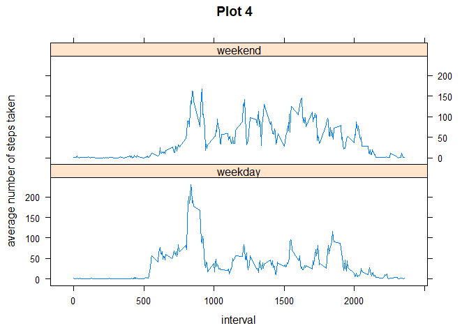

```r
knitr::opts_chunk$set(fig.path='Figs/')
```

## Loading and preprocessing the data

We will use dplyr package for this analysis


```r
library(dplyr)
```

First we load the data


```r
data <- read.csv("C:/Users/User/Desktop/Data Science/Reproducible Research/Project Week 2/activity.csv")
data$date <- as.Date(data$date , format = "%Y-%m-%d")
```

## What is mean total number of steps taken per day?

We will ignore the missing values in the dataset.


```r
m <- complete.cases(data)
dat <- data[m,]
```

Calculation of the total number of steps taken per day:

```r
da <- group_by(dat, date)
Q1 <- as.data.frame(summarize(da, totsteps = sum(steps)))
```

Histogram of the total number of steps taken each day

```r
hist(Q1$totsteps, xlab ="total steps", main = "Plot 1")
```

<!-- -->

Mean and median of the total number of steps taken per day:

```r
mean(Q1$totsteps)
```

```
## [1] 10766.19
```

```r
median(Q1$totsteps)
```

```
## [1] 10765
```

## What is the average daily activity pattern?

We will ignore the missing values in the dataset.


```r
m <- complete.cases(data)
dat <- data[m,]
```

Make a plot of the 5 minute interval vs the average number of steps taken, averaged across all days.


```r
da2 <- group_by(dat, interval)
Q2 <- as.data.frame(summarize(da2, totsteps = sum(steps), mean = mean(steps), interval = interval))
with(Q2, plot(interval, mean, type = "l", main = "Plot 2", ylab = "average number of steps taken"))
```

<!-- -->

The 5 minute interval on average across all days that contains the maximum number of steps is calculated with:


```r
print(Q2[which.max(Q2$mean), "interval"])
```

```
## [1] 835
```


## Imputing missing values

The total number of missing values in the dataset is calculated with


```r
sum(is.na(data))
```

```
## [1] 2304
```

We create a new dataset called **copy_data** that is a copy of the initial data set.


```r
copy_data <- data.frame(data)
```

We fill in all the missing values of the dataset **copy_data**, with the mean for the 5 minute interval.


```r
pls <- group_by(copy_data, interval)
Q3 <- as.data.frame(summarize(pls, mean = mean(steps, na.rm = TRUE)))
copy_data$steps <- ifelse(is.na(copy_data$steps) == TRUE, Q3$mean[Q3$interval %in% copy_data$interval], copy_data$steps) 
```

We rearrange the data to obtain the total number of steps taken each day, and use it to make a histogram:


```r
gr <- group_by(copy_data, date)
sum3 <- as.data.frame(summarize(gr, totsteps = sum(steps)))
hist(sum3$totsteps, xlab = "total number of steps", main = "Plot 3")
```

<!-- -->

We calculate the mean and median of the total number of steps taken per day:


```r
mean(sum3$totsteps)
```

```
## [1] 10766.19
```

```r
median(sum3$totsteps)
```

```
## [1] 10766.19
```


We can see that the values do not almost differ from the first part of the assigment where we removed the missing values.


```r
Q <- c(1, 3)
mean <- c(mean(Q1$totsteps), mean(sum3$totsteps))
median <- c(median(Q1$totsteps), median(sum3$totsteps))
comparation <- as.data.frame(cbind(Q, mean, median))
comparation
```

```
##   Q     mean   median
## 1 1 10766.19 10765.00
## 2 3 10766.19 10766.19
```

## Are there differences in activity patterns between weekdays and weekends?

We will use lattice package for this analysis


```r
library(lattice)
```

We create a new factor variable in the dataset with two leveles; weekday and weekend.


```r
q4 <- mutate(copy_data, day = weekdays(copy_data$date))
q4$day <- ifelse(q4$day %in% c("sábado", "domingo"), "weekend", "weekday")
head(q4)
```

```
##       steps       date interval     day
## 1 1.7169811 2012-10-01        0 weekday
## 2 0.3396226 2012-10-01        5 weekday
## 3 0.1320755 2012-10-01       10 weekday
## 4 0.1509434 2012-10-01       15 weekday
## 5 0.0754717 2012-10-01       20 weekday
## 6 2.0943396 2012-10-01       25 weekday
```

We rearrange the dataset **copy_data**, to make a plot of the 5 minute interval vs the average number of steps taken, averaged across all weekday days or weekend days.


```r
gr4 <- group_by(q4, day, interval)
Q4.2 <- as.data.frame(summarize(gr4, mean = mean(steps)))
xyplot(mean ~ interval | day, data = Q4.2 , layout = c(1, 2), type = "l", main = "Plot 4", ylab = "average number of steps taken")
```

<!-- -->
